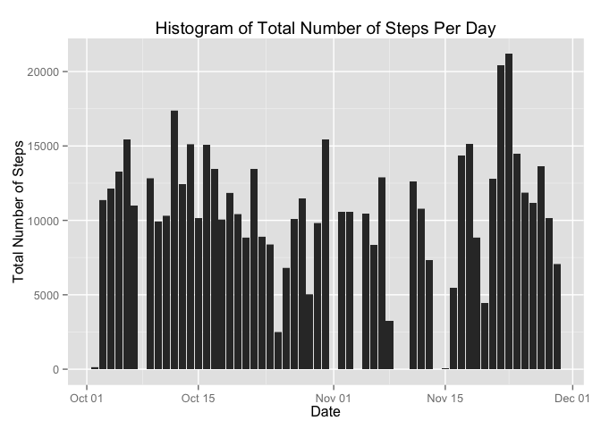
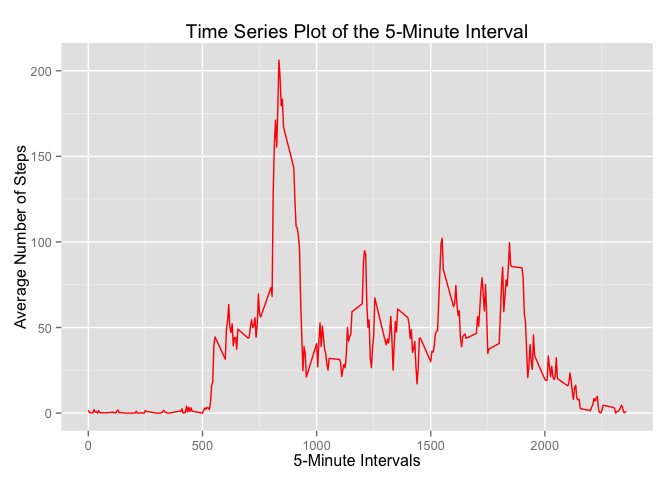
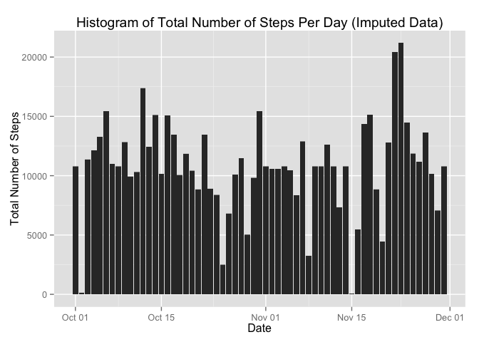
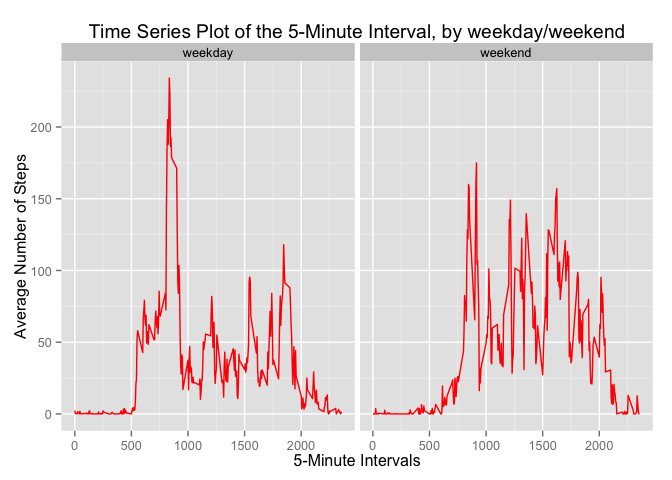

# PA_template
Jonathan Lewyckyj  
July 18, 2015  


```r
echo = TRUE
```

#Loading and Preprocessing the Data


```r
setwd("/Users/Jonathan/Desktop/Coursera/RepResearch")
data <- read.csv("activity.csv", colClasses = c("integer", "Date", "factor"))

data2 <- na.omit(data)
```

#What is the mean total number of steps taken per day?

##Calculate the total number of steps taken per day


```r
totalSteps <- aggregate(data2$steps, list(Date = data2$date), FUN = "sum")$x
```

##Make a histogram of the total number of steps taken each day


```r
library(ggplot2)
```

```
## Warning: package 'ggplot2' was built under R version 3.1.3
```

```r
ggplot(data2, aes(date, steps)) + geom_bar(stat = "identity") + labs(title = "Histogram of Total Number of Steps Per Day", x = "Date", y = "Total Number of Steps")
```

 

##Calculate and report the mean and median of the total number of steps taken per day


```r
medianTotalSteps <- median(totalSteps)
meanTotalSteps <- mean(totalSteps)
print(medianTotalSteps)
```

```
## [1] 10765
```

```r
print(meanTotalSteps)
```

```
## [1] 10766.19
```

#What is the average daily activity pattern?

##Make a time series plot (i.e. type = "l") of the 5-minute interval (x-axis) and 
##the average number of steps taken, averaged across all days (y-axis)


```r
avgSteps <- aggregate(data2$steps, list(interval = as.numeric(as.character(data2$interval))), FUN = "mean")
names(avgSteps)[2] <- "MeanSteps"

ggplot(avgSteps, aes(interval, MeanSteps)) + geom_line(color = "red") + labs(title = "Time Series Plot of the 5-Minute Interval", x = "5-Minute Intervals", y = "Average Number of Steps")
```

 

##Which 5-minute interval, on average across all the days in the dataset, contains the maximum number of steps?


```r
avgSteps[avgSteps$MeanSteps == max(avgSteps$MeanSteps), ]
```

```
##     interval MeanSteps
## 104      835  206.1698
```

#Imputing missing values

##Calculate and report the total number of missing values in the dataset


```r
sum(is.na(data))
```

```
## [1] 2304
```

##Devise a strategy for filling in all of the missing values in the dataset.
##The strategy does not need to be sophisticated. For example, you could use the 
##mean/median for that day, or the mean for that 5-minute interval, etc.

###Strategy: Use mean for that 5-minute interval to impute missing values for steps

##Create a new dataset that is equal to the original dataset but with the missing data filled in


```r
imputedData <- data 
for (i in 1:nrow(imputedData)) {
    if (is.na(imputedData$steps[i])) {
        imputedData$steps[i] <- avgSteps[which(imputedData$interval[i] == avgSteps$interval), ]$MeanSteps
    }
}
```

##Make a histogram of the total number of steps taken each day


```r
ggplot(imputedData, aes(date, steps)) + geom_bar(stat = "identity") + labs(title = "Histogram of Total Number of Steps Per Day (Imputed Data)", x = "Date", y = "Total Number of Steps")
```

 

##Calculate and report the mean and median total number of steps taken per day


```r
totalSteps.Imputed <- aggregate(imputedData$steps, list(Date = imputedData$date), FUN = "sum")$x

medianTotalSteps.Imputed <- median(totalSteps.Imputed)
meanTotalSteps.Imputed <- mean(totalSteps.Imputed)
```

##Do these values differ from the estimates from the first part of the assignment?
##What is the impact of imputing missing data on the estimates of the total daily number of steps?


```r
print(medianTotalSteps)
```

```
## [1] 10765
```

```r
print(medianTotalSteps.Imputed)
```

```
## [1] 10766.19
```

```r
print(meanTotalSteps)
```

```
## [1] 10766.19
```

```r
print(meanTotalSteps.Imputed)
```

```
## [1] 10766.19
```

###Mean stays the same, Median is raised by 1.19

#Are there differences in activity pattersn between weekdays and weekends?

##Create a new factor variable in the dataset with two levels - "weekday" and "weekend" 
##indicating whether a given date is a weekday or a weekend


```r
data2$weekday <- weekdays(data2$date)
data2$weekday <- ifelse(data2$weekday %in% c("Saturday", "Sunday"), "weekend", "weekday")

levels(data2$weekday) <- list(weekday = c("Monday", "Tuesday", "Wednesday", "Thursday", "Friday"), weekend = c("Saturday", "Sunday"))
```

##Make a panel plot containing a time series plot (i.e. type = "l") of the 5-minute interval (x-axis) and the average number 
##of steps taken, averaged across all weekday days or weekend days (y-axis). See the README file in the GitHub repository to see 
##an example of what this plot should look like using simulated data.


```r
avgSteps2 <- aggregate(data2$steps, list(interval = as.numeric(as.character(data2$interval)), weekday = data2$weekday), FUN = "mean")
names(avgSteps2)[3] <- "MeanSteps"

ggplot(avgSteps2, aes(x = interval, y = MeanSteps)) + geom_line(color = "red") + facet_grid(. ~ weekday) + labs(title = "Time Series Plot of the 5-Minute Interval, by weekday/weekend", x = "5-Minute Intervals", y = "Average Number of Steps")
```

 
